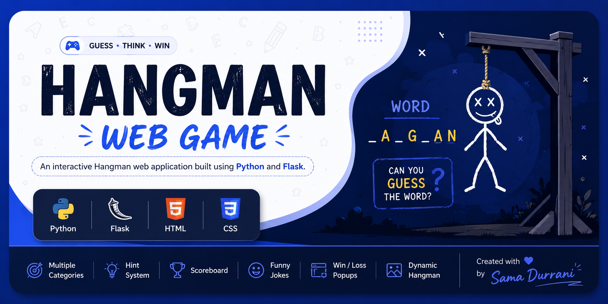
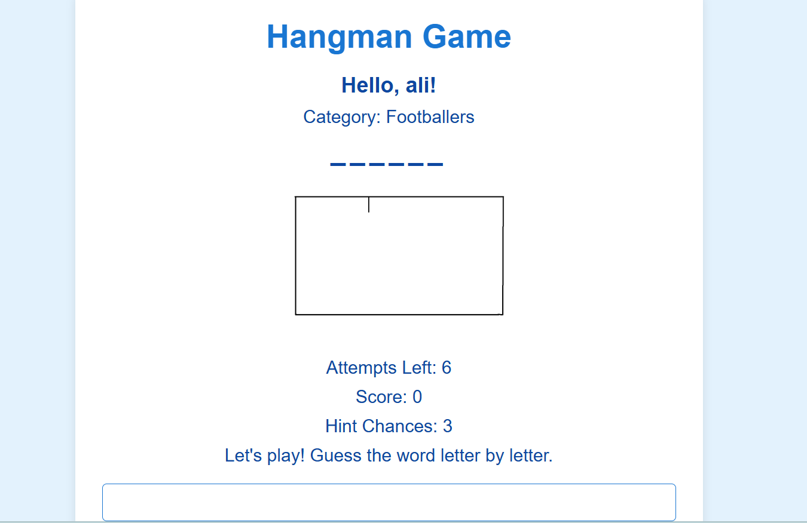
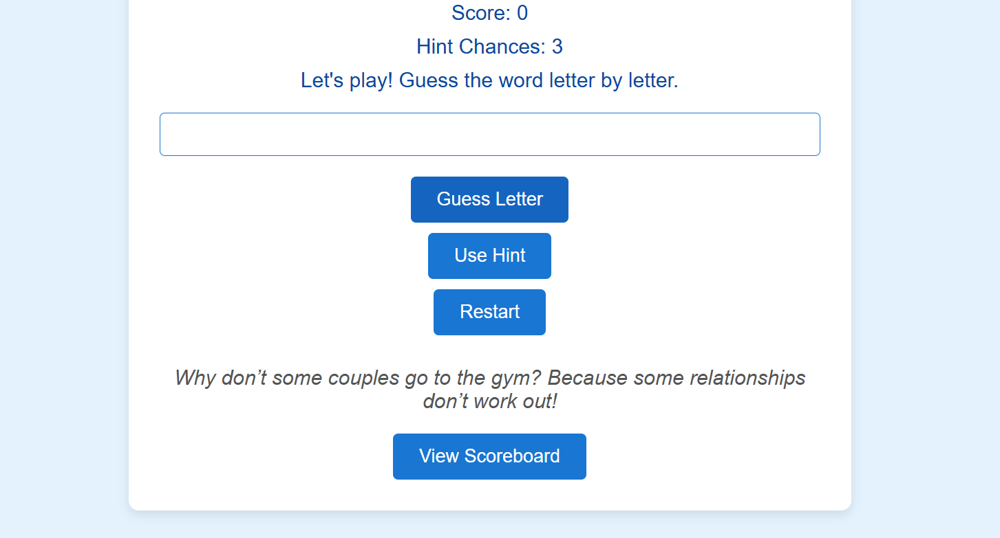
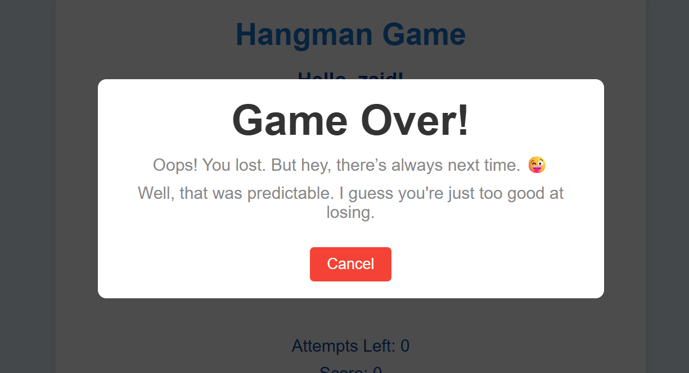
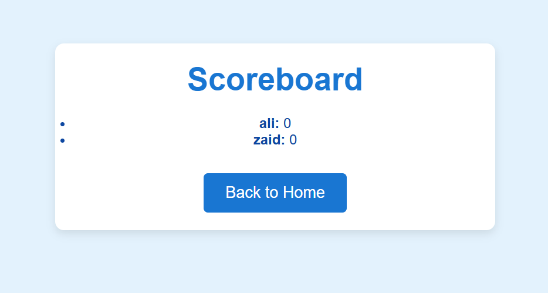

<p align="center">
  
</p>


# 🎮 Hangman Web Game

An interactive Hangman web application built using **Python** and **Flask**.

## 📌 Overview

This project was developed as part of my Programming Fundamentals course during my first semester of BS Computer Science.

The application allows users to play the classic Hangman game through a web interface with multiple categories, hints, score tracking, and interactive gameplay.

---

## ✨ Features

- Random word selection
- Multiple categories
  - Fruits
  - Countries
  - Cricketers
  - Footballers
  - Foods
  - Vegetables
- Hint system
- Scoreboard
- Funny jokes after guesses
- Win/Loss popup messages
- Dynamic Hangman images
- User score tracking

---


## 🛠 Tech Stack


- Python
- Flask
- HTML
- CSS
- Jinja2 Templates

---

## 🚀 How to Run

Clone the repository

```bash
git clone https://github.com/sama7durrani-max/hangman-web-game.git
```

Install Flask

```bash
pip install flask
```

Run

```bash
python app.py
```

Open

```
http://127.0.0.1:5000
```

---

## 📷 Screenshots


### 🏠 Home Page

<p align="center">

</p>

---

### 🎮 Gameplay

<p align="center">

  

</p>

---

### 🏆 Winner Screen

<p align="center">

</p>

---

### 🏆 GameOver Screen

<p align="center">

</p>


### 📊 Scoreboard

<p align="center">

</p>

---

## 👩‍💻 Author

Sama Durrani

BS Computer Science
